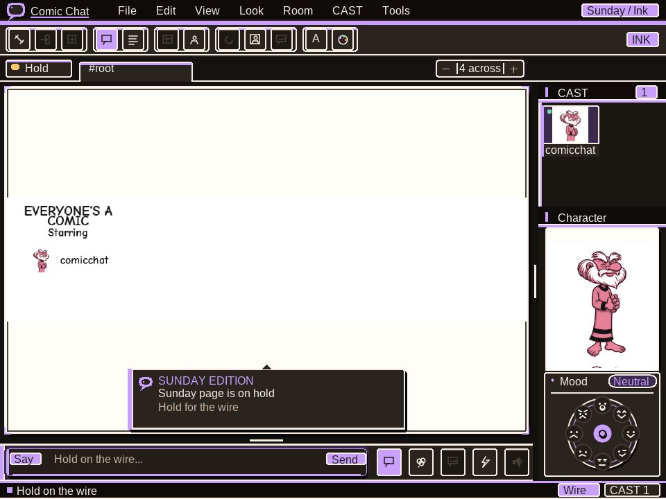
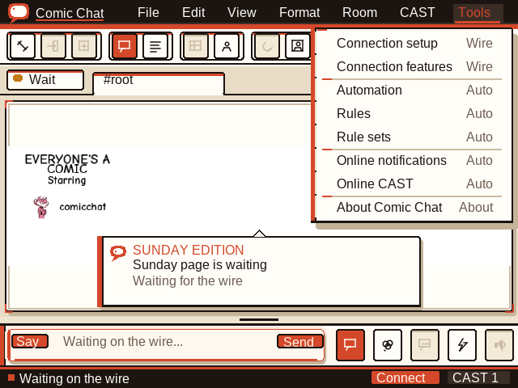
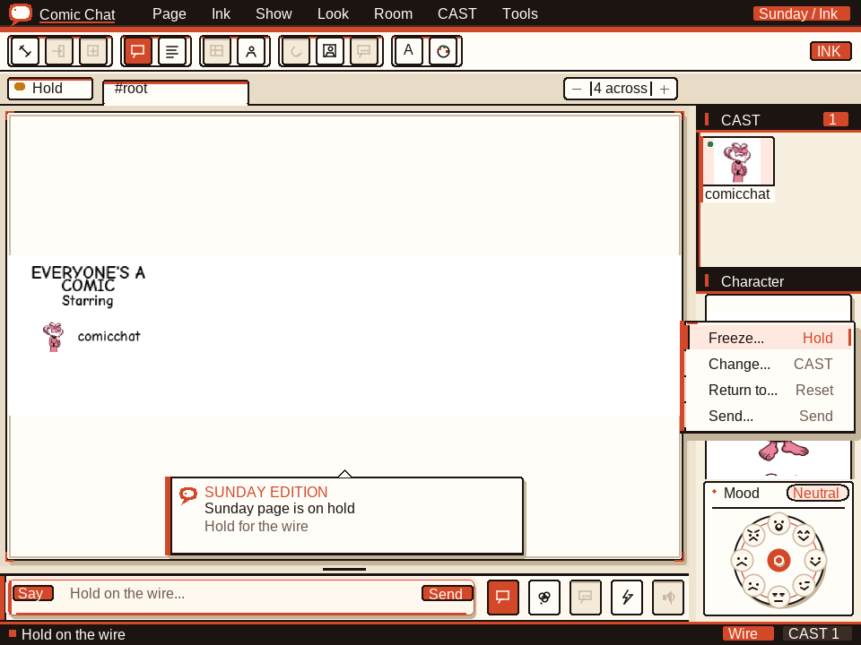

# Comic Chat: Reinked

A portable, source-faithful continuation of **Comic Chat: Reinked**, built in Zig with
a software renderer, native X11/Wayland/Win32 presentation, and verified TLS.







Comic Chat turns IRC conversations into auto-generated comic strips. Each
participant has an avatar, and the client composes panels with speech balloons,
poses, and emotions while remaining interoperable with ordinary IRC clients.

The rendering reference is Microsoft's open-source Comic Chat repository:
<https://github.com/microsoft/comic-chat>. The portable implementation ports
the original panel, avatar-placement, balloon, and emotion behavior from that
source instead of approximating it from screenshots. The external historical
reference is pinned to revision `c7df00f60bc8e9fdef413f139e61f7c37e024684`.

The portable page keeps the released client's visible contract: an implicit
borderless title/starring panel, 2300×2300 logical conversation panels, two
panels per row, 144-unit interstices, authored AVB icons and mask layers, and
source-seeded panel/balloon layout. Comic Neue Bold and Bold Italic are bundled
as the SIL-OFL portable substitutes for the proprietary Comic Sans MS faces
requested by the historical Windows client. As in Microsoft's source, only
Woodring whisper balloons select the
italic face.

## Project layout

| Area | Path | Purpose |
| --- | --- | --- |
| Portable client | `src/` | Zig IRC client, AVB/BGB decoding, original rendering behavior, software rasterizer, and native X11/Wayland/Win32 presentation |
| Runtime assets | `assets/` and `src/assets/testdata/` | Attributed character, backdrop, and emotion content required by the portable renderer |
| Protocol notes | `docs/PROTOCOL.md` | Comic Chat wire-format and interoperability notes |
| Microsoft wire audit | `docs/MICROSOFT_WIRE_AUDIT.md` | Source-by-source IRC/IRCX/UDI/CTCP compatibility ledger |
| Completeness audit | `docs/PORTABLE_COMPLETENESS_AUDIT.md` | Reachable, substrate-only, partial, and missing portable product surfaces |
| Repository map | `docs/PROJECT_STRUCTURE.md` | Portable-first repository ownership and layout |
| Historical reference | `legacy/docs/` | Repository-only Microsoft-source audits and migration records; excluded from release packages |

## Portable Zig client

The active tree is tested with Zig `0.17.0-dev.1282+c0f9b51d8`:

```sh
zig build test
zig build
zig build run                         # record-codec demo
zig build run -- render-strip > comic.ppm
zig build run -- window anna          # native window/backend smoke
zig build run -- app irc.example nick '#channel'              # verified TLS, port 6697
zig build run -- app irc.example 6697 nick '#channel' --ca-file ./ca.pem
zig build run -- app irc.example nick '#channel' --socks5 127.0.0.1:1080
zig build run -- app irc.example nick '#channel' --http-proxy proxy.example:8080
zig build run -- app localhost 6667 nick '#channel' --plaintext
zig build run -- app your-nick                          # eshmaki.me, #root
zig build run -- app eshmaki.me your-nick '#root' \
  --tls-cert ./client-cert-and-key.pem --sasl-user your-account --sasl-external
```

## Releases

Each `comicchat-portable-*` GitHub release contains a portable source archive,
Windows x86_64 ZIP, Linux x86_64 and aarch64 tarballs, FreeBSD x86_64 tarball, OpenBSD
x86_64 tarball, and a SHA-256 manifest. Download the archive for your
platform, extract it, and run `reinked` (or `reinked.exe` on Windows).

Verify downloaded artifacts before use:

```sh
sha256sum -c reinked-*-SHA256SUMS.txt
```

To produce the same release set locally from a clean committed checkout:

```sh
OUTPUT_DIR="$PWD/dist" TMPDIR="$PWD/.tmp-release" \
  tools/package-release.sh comicchat-portable-YYYY-MM-DD.N
```

The tag workflow runs the portable tests, creates this exact artifact set, and
publishes it with its checksum manifest. Historical Microsoft/MFC workflows
are not part of the portable release contract.

On Windows, double-clicking `reinked.exe` opens the desktop client directly
with the configured `eshmaki.me`, `ircx.us`, and `#root` defaults. Use
`reinked.exe app <nick>` or the full command form above to override them.
Passing a `.ccc` conversation or `.ccr` locator as the only argument opens it
directly. Optional per-user Windows and freedesktop file-association helpers
are included under `packaging/`.

The app opens before DNS/TCP/TLS setup and keeps the native event loop live
while a bounded connector races IPv6/IPv4 candidates. `--connect-timeout-ms`
sets the per-address and proxy-read deadline. SOCKS5 uses no-auth remote-DNS
CONNECT; HTTP proxies use a bounded CONNECT response. TLS hostname and chain
verification still target the IRC host after either proxy handshake.

Hostname lookup uses the pinned Onyx Server DNS wire codec and resolver policy.
The transport, resolver, TLS client, and native socket adapters are Zig-only;
Windows uses a direct Winsock boundary so the same executable works on Windows
and Wine without Zig's AFD backend. The Windows DNS service is used only if
direct Onyx UDP resolution is unavailable.

On Onyx Server, authenticated clients persist reusable `SESSION TOKEN` and
portable `SESSION MTOKEN` credentials in `.comicchat-session` (override with
`--session-file`). After SASL succeeds, reconnects prefer the unexpired mesh
credential, issue `SESSION RESUME` before joining, and then request fresh
credentials. This is the exact-token boundary required for multiple live
clients using the same account and nickname to share one logical session.
Session files are written atomically with owner-only permissions on POSIX.

Inside the desktop client, room tabs are clickable and retain independent
transcripts, rosters, unread counts, and unfinished drafts. The corresponding
keyboard commands are `/join #room`, `/switch #room`, and `/part`. Use
`/view comic`, `/view text`, `/members`, `/avatar name`, and `/dialog IDD_*`
for view and source-dialog workflows. Conversation files and rendered UI
captures use `/open path.ccc`, `/save path.ccc`, and `/export path.png`;
writes are bounded and atomic.

File, Edit, and Format also expose native Open/Save selection, recent
conversations, transcript range selection/copy/delete, source page-break
editing, printable PDF export/open/print, and bold/italic/underline composer
controls. The multiline composer sends each entered line through the same
bounded IRC path. Windows uses the Unicode clipboard and common file dialogs;
Wayland/X11 speak the native clipboard protocols (`wl_data_device` /
ICCCM `CLIPBOARD`) and fall back to `wl-copy`/`xclip`/`xsel` plus the
internal clipboard/path editor when the desktop helper is missing.

The status bar and the first toolbar button both open a prefilled live
Connection Setup dialog. Applying it stops the current connection, validates
the endpoint and security choice, and reconnects immediately. The room member
pane consumes live NAMES/JOIN/PART/QUIT/NICK state, reports active rather than
historical members, scrolls with the wheel, keeps keyboard selection visible,
and maps selection and context actions to the correct scrolled member.
NAMES prefixes and live MODE changes drive visible voice/half-op/operator/owner
badges; room administration, Kick, and Ban controls disable when the local
member lacks permission.
Edit > Settings controls persistent conversation view, panel density,
member-pane visibility, and member layout. Connection Setup remains the
separate live reconnect path. Room List
uses source-shaped LIST/LISTX queries and optionally joins a result, User List
selects an active member, and Comic View applies both content mode and one-to-six panel density. Sparse conversations
reserve that selected desktop grid, so a single message or break control can
never expand into a full-buffer panel.

Room and Member menus now expose the remaining live workflows: IRCX PROP,
ACCESS, LISTX, and operator EVENT commands; persistent personal-profile and
member-profile requests; bundled backdrop synchronization; greeting/flood
automation; persistent rules; WHO-backed logon notifications; portable HTTPS
call links; and consent-gated DCC transfers. Incoming files require an explicit
save path, never replace an existing file, remain bounded to 16 MiB, report
progress, and can be cancelled without retaining a partial file. The retired
Windows NetMeeting control is answered with `NOHAVE`; it is never launched.
Favorites, recent files, advanced rule sets/import/export, occurrence limits,
desktop online/offline notifications, Connection Features, and an independent
room-window command are reachable from the modern menus.

The live comic wire path is checked against Microsoft's released
`bInsertAnnotations`, `bChatSendToTarget`, `OnDataMsg`, and `ProcessSay`
implementations. IRCX uses `DATA ... CCUDI1` for both UDI and comment controls;
plain IRC embeds UDI or sends comment controls with `PRIVMSG`. Comic actions
stay as readable text with mode `M5`, and selected/whisper members are included
in the UDI `T` list.

The complete source-to-wire ledger is
[`docs/MICROSOFT_WIRE_AUDIT.md`](docs/MICROSOFT_WIRE_AUDIT.md). It also covers
the two-stage IRCX probe, exact trailing parameters, password JOIN, CREATE,
reasoned KICK, exact IRCX ACCESS/PROP/LISTX/EVENT grammar, DCC consent and ACK
flow, CTCP SOUND/AWAY/information controls, and the Onyx same-account same-nick
session extension.

The portable desktop UI has a shared Fluent-style component library and a
separate neutral application font; Comic Neue remains confined to comic
content. Its persistent Settings surface controls light or dark studio chrome,
cobalt/violet/forest accents, standard or high contrast, comic density, member
presentation, and status detail. Dark studio colors are resolved while controls
are drawn; comic pages and character artwork retain their authored pixels. The
Status tab and bottom connection strip open the same connection/activity panel
with direct Connection setup and Settings actions. See `docs/UI_LIBRARY.md`.
Exact headless previews are available with `zig build run -- render-ui`, plus
the `conversation`, `menu`, `settings`, `dark`, `dark-settings`, `character`,
and `status` variants. Any registered dialog has a deterministic preview through
`zig build run -- render-ui dialog-<enum_name>`, for example
`dialog-file_transfer` or `dialog-room_access`.

`--tls-cert <cert-and-key.pem>` presents a PEM client certificate and private
key for SASL EXTERNAL. Onyx TLS presents the certificate during a verified TLS
1.3 handshake; connections without a client certificate use the same verified
TLS 1.3 transport.

### Regenerating the portable font atlas

The generated atlas is reproducible from
[Comic Neue](https://github.com/crozynski/comicneue) commit
`ef5be72411141d01f0b865df8edb47e552c11c3c`. With Python and Pillow installed,
pass that revision's `ComicNeue-Bold.ttf` and `ComicNeue-BoldItalic.ttf` to the
generator. Pillow is pinned because its bundled FreeType rasterizer is part of
the byte-exact atlas toolchain:

```sh
python3 -m pip install -r tools/font-requirements.txt
python3 tools/generate_font.py \
  /path/to/ComicNeue-Bold.ttf \
  /path/to/ComicNeue-BoldItalic.ttf
```

The generator rejects inputs unless their SHA-256 values are respectively
`3e7e5fccfd7e0788f317b43312151c1bd5cf058c9697a8d83eac3939050bd61e`
and
`5c312c2a2fa64eee82f3b87fcfab8f3b12a5e59b043124401d322eb323cfbf16`.
It also rejects rasterizer drift before rewriting `font.zig`/`fontdata.bin` and
`font_italic.zig`/`fontdata_italic.bin`. The SIL Open Font License covering both
faces is retained in `src/render/COMIC_NEUE_LICENSE.txt`.

Cross-compile examples:

```sh
zig build -Dtarget=x86_64-linux
zig build -Dtarget=aarch64-linux
zig build linux
zig build -Dtarget=x86_64-windows
zig build -Dtarget=aarch64-windows
```

Cross-compilation installs the Windows binary at
`zig-out\bin\comicchat.exe`; it does not execute it. The pinned Onyx TLS
implementation requires a 64-bit target, so 32-bit Windows is not supported.
On Linux, a nonempty
`WAYLAND_DISPLAY` selects the Wayland backend and an unset/empty value selects
X11. There is no automatic fallback after a Wayland connection failure. To
force the X11 smoke explicitly:

```sh
env -u WAYLAND_DISPLAY zig build run -- window anna
```

## Release packages

The current published release is `comicchat-portable-2026-07-21.1`.
It contains x86_64 binary packages for Windows, Linux, FreeBSD, and OpenBSD,
an explicit buildable source archive, and a single SHA-256 manifest covering
all five artifacts. The source archive includes the narrow Onyx TLS dependency
snapshot exported from its pinned revision, so it builds after extraction
without a separate submodule checkout.

Verify downloaded artifacts before use:

```sh
sha256sum -c comicchat-portable-2026-07-21.1-SHA256SUMS.txt
```

To build the binary archives from a clean checkout:

```sh
./tools/package-release.sh portable-2026-07-21.1
```

Each archive contains the executable, this README, the AGPL license, and
third-party notices. The explicit source archive contains only the Onyx crypto,
protocol, and certificate-loader sources used by ComicChat and builds without
a second checkout. Legacy audit material is not included. Comic characters,
backdrops, face expressions, and fonts are embedded in the binaries.
`comicchat app <nick>` defaults to the `eshmaki.me` server and `#root` channel;
pass a host and/or channel to override either default.

The direct Wayland client parses compositor XKB keymaps (base, Shift, and
AltGr/ISO Level3 when listed), implements configured key repeat, composes
bounded dead-key / Multi_key accents and optional XCompose locale tables,
accepts committed IME text through text-input-v3, maps native touch contacts
to the shared interaction contract, tracks entered `wl_output` integer scale
plus `wp_fractional_scale_v1` / `wp_viewporter` when advertised, advertises
xdg-shell min/max size, and copies through `wl_data_device` and
`zwp_primary_selection_v1`.
X11 authenticates with MIT-MAGIC-COOKIE-1, talks to local UNIX sockets or
TCP `host:N` / `localhost:N` (`ssh -X`), presents integer HiDPI frames from
`GDK_SCALE`/`GDK_DPI_SCALE`/`Xft.dpi`, owns ICCCM CLIPBOARD+PRIMARY including
INCR with STRING/TEXT fallbacks, sets `_NET_WM_ICON_NAME` and
`_NET_WM_USER_TIME`, and replies to `_NET_WM_PING`.
Win32 uses per-monitor-v2 DPI geometry, Unicode/IME input, the Unicode
clipboard, and native common dialogs. Window creation, configure/resize,
scaled presentation, keyboard/pointer input, IRC traffic, and clean close
are implemented across Wayland, X11, Win32, FreeBSD, and OpenBSD.

The portable lane has no SDL dependency. Native backends speak the Wayland/X11
protocols or Win32 APIs directly, and all display the same software-rendered
comic framebuffer. IRC connections use verified TLS by default on port 6697,
through the pinned Onyx TLS implementation. The client
requires a trusted certificate, sends SNI, verifies the requested hostname,
and never falls back to plaintext. It loads the Windows ROOT certificate store
or common Unix CA bundles; `--ca-file <pem>` overrides those roots.
`--plaintext` is an explicit compatibility mode for trusted local servers that
do not offer TLS and must not be used for credentials on untrusted networks.

Live messages use the released compact UDI grammar: the portable client reads
both embedded non-IRCX annotations and IRCX `DATA ... CCUDI1` state; preserves
the authored face/torso ordinals, emotion, intensity, requested-pose flag,
balloon mode, and talk-to participants; and renders that cooked AVB state. For
outgoing text it runs the source-derived pose rules and uses the original
embedded annotation form in one `PRIVMSG`, including when IRCX is available.
It also accepts standalone `DATA` metadata sent by peers. Ordinary IRC clients
still receive readable message text.
The client also consumes the source `# Appears as ...` avatar control, announces
its current bundled avatar after joining, and supports `/avatar <name>` in the
interactive input so later panels use the selected character.

## Design tenets

- **Source-faithful rendering.** Microsoft's original implementation is the
  behavioral source of truth for panel splitting, avatar order and scale,
  emotion selection, text measurement, balloon routing, and tails.
- **One portable core.** Protocol, assets, layout, rendering, and client state
  are platform-independent; native backends own window/event integration and
  framebuffer presentation.
- **Interoperable IRC.** Comic metadata remains compatible with ordinary IRC;
  clients without Comic Chat still see the conversation text.
- **Portable product first.** This repository ships one portable client; it
  does not vendor a second MFC/C++ implementation.

## License and provenance

ComicChat's portable code is licensed under **AGPL-3.0-or-later**. The
historical Comic Chat source is MIT-licensed and remains an external reference
at <https://github.com/microsoft/comic-chat>; its MFC/C++ tree is not vendored
here. Microsoft names, logos, and artwork may be trademarks, and
builds from this repository are unofficial and unsupported. The portable asset
set's historical source and transformation record is repository-only legacy
material and is intentionally excluded from release packages.
The generated portable font atlases are derived from Comic Neue Bold and Bold
Italic under the SIL Open Font License; see
[`src/render/COMIC_NEUE_LICENSE.txt`](src/render/COMIC_NEUE_LICENSE.txt).
The pinned Onyx Server TLS implementation is included as an AGPL-3.0-or-later
submodule under `third_party/onyx-server`; release sources export only the
dependency subset used by the client.
